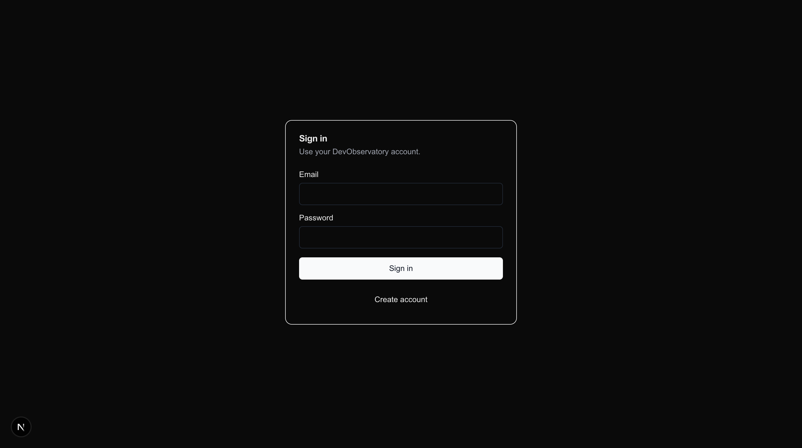
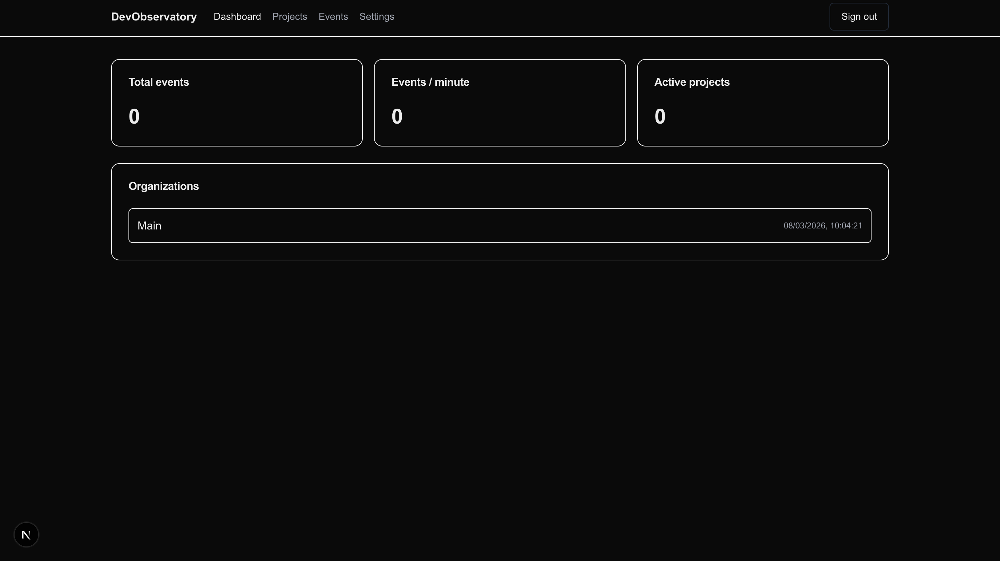
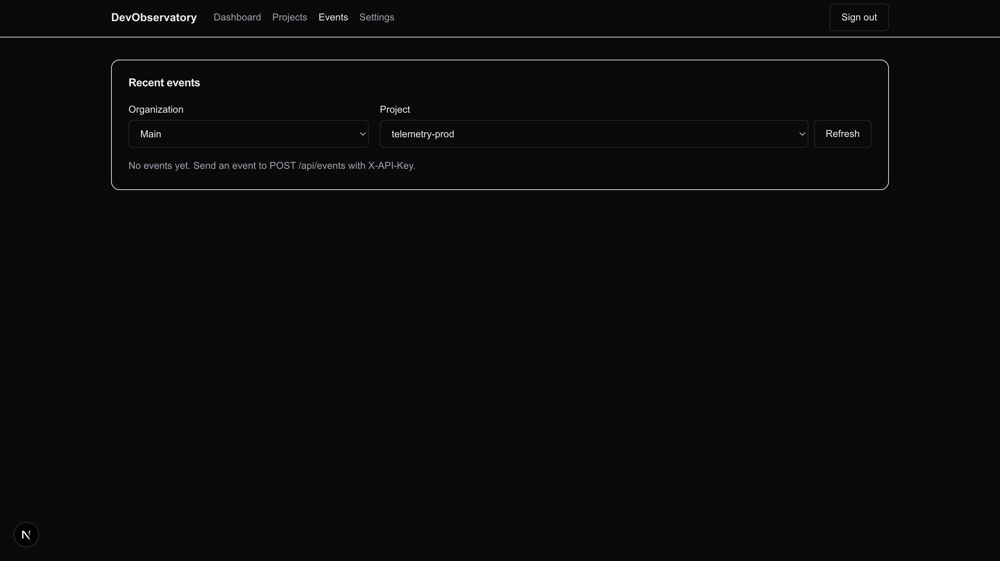

# DevObservatory

DevObservatory is a lightweight “developer observability” side project: create projects, mint API keys, ingest events, and explore them in a small UI.

## Screenshots





## Features

- Organizations and Projects
- API keys per project
- Event ingestion (`X-API-Key`)
- Event query UI (last 200 events)
- Rate limiting (SlowAPI)
- Async ingestion pipeline (RabbitMQ + worker)

## Tech Stack

- Backend: FastAPI + SQLAlchemy + Alembic + Postgres
- Frontend: Next.js (App Router) + Tailwind
- Queue/Worker: RabbitMQ + aio-pika worker
- Infra: Docker Compose (Postgres, Redis, RabbitMQ, MinIO)

## Architecture

High-level flow:

1. Client sends event to `POST /api/events` using `X-API-Key`.
2. Backend validates key and publishes to RabbitMQ queue `events`.
3. Worker consumes and persists to Postgres.
4. Frontend queries backend via Next.js BFF routes (`/api/*`) and httpOnly cookies.

More details: [docs/ARCHITECTURE.md](docs/ARCHITECTURE.md)

## Repo Layout

- backend/: FastAPI API server + Alembic migrations
- worker/: RabbitMQ consumer that writes events to Postgres
- frontend/: Next.js UI + BFF routes under `src/app/api`
- docker/: Dockerfiles
- scripts/: run helpers (Docker + local dev)
- docs/: diagrams + screenshots
- docker-compose.yml: local runtime

## Ports

| Service | URL |
|---|---|
| Frontend | http://localhost:3000 |
| Backend | http://localhost:8000 |
| Backend health | http://localhost:8000/healthz |
| RabbitMQ management | http://localhost:15672 |
| Postgres | localhost:5432 |
| Redis | localhost:6379 |
| MinIO S3 API | http://localhost:9000 |
| MinIO console | http://localhost:9001 |

## How to Run

### Option A: All-in-Docker (fastest)

Prereqs: Docker Desktop (or Docker Engine + Compose).

```bash
bash scripts/docker-up.sh
```

Open:

- UI: http://localhost:3000
- API health: http://localhost:8000/healthz

Stop:

```bash
bash scripts/docker-down.sh
```

Reset volumes (drops Postgres + MinIO data):

```bash
bash scripts/docker-reset.sh
```

### Option B: Docker infra + local dev servers (best for development)

Prereqs:

- Docker
- Node.js (frontend)
- Python 3.12 (backend)

Start infra services only:

```bash
bash scripts/docker-infra-up.sh
```

Run backend (creates `backend/.venv` and installs deps automatically):

```bash
bash scripts/dev-backend.sh
```

Run frontend:

```bash
bash scripts/dev-frontend.sh
```

## Smoke Test

Minimal end-to-end path (register → login → create org/project → create api key → ingest event → query events):

```bash
bash scripts/smoke.sh
```

## API Overview

Base URL: `http://localhost:8000/api`

Auth:

- `POST /auth/register`
- `POST /auth/login`
- `POST /auth/refresh`
- `POST /auth/logout`
- `GET /auth/me`

Orgs / projects:

- `POST /orgs`
- `POST /orgs/{org_id}/projects`
- `POST /projects/{project_id}/api-keys`

Events:

- `POST /events` (requires `X-API-Key`)
- `GET /projects/{project_id}/events` (requires Bearer access token)

Frontend BFF:

- Next.js server routes live in [frontend/src/app/api](frontend/src/app/api).
- They forward requests to the backend using `API_BASE_URL` / `NEXT_PUBLIC_API_BASE_URL` and manage auth cookies.

## Configuration

Backend (see [backend/app/core/config.py](backend/app/core/config.py)):

- `POSTGRES_DSN`
- `REDIS_URL`
- `RABBITMQ_URL`
- `JWT_SECRET_KEY`
- `CORS_ALLOW_ORIGINS` (JSON string)
- `S3_ENDPOINT_URL`, `S3_ACCESS_KEY_ID`, `S3_SECRET_ACCESS_KEY`, `S3_BUCKET`

Frontend:

- `NEXT_PUBLIC_API_BASE_URL`
- `API_BASE_URL`

## Troubleshooting

- Signup returns 500: check backend logs; password hashing relies on `passlib` + `bcrypt`.
- Hydration mismatch warnings: browser extensions can inject attributes into the DOM before React hydrates.
- Queue unavailable: RabbitMQ might not be ready yet; restart the worker or wait a few seconds.

## License

Add a license file before publishing if you plan to open-source this.
