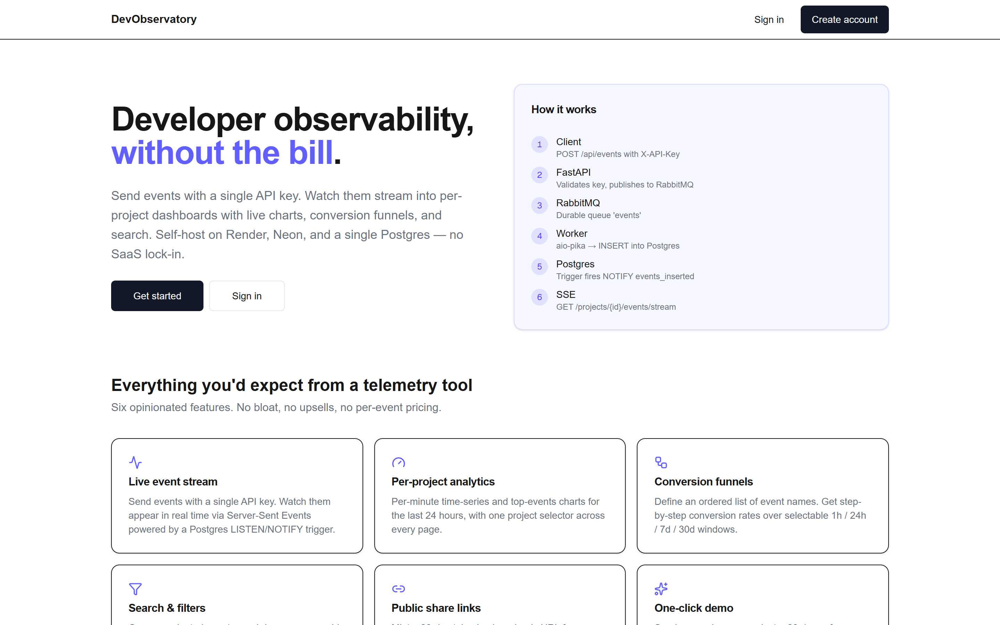
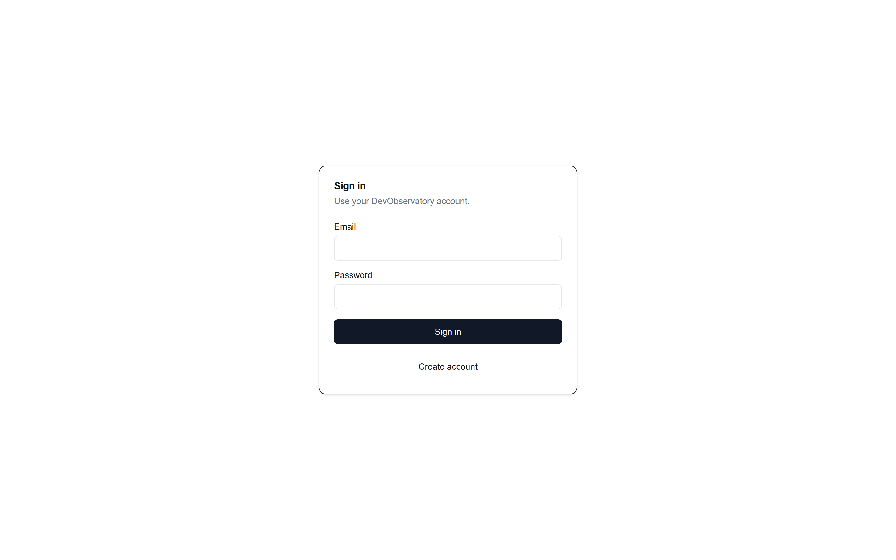
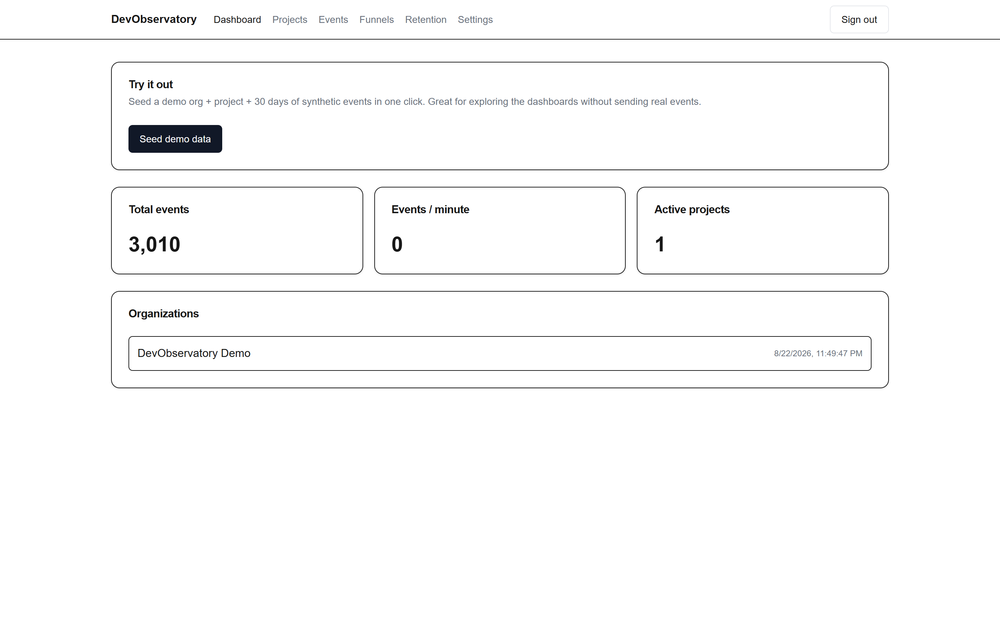
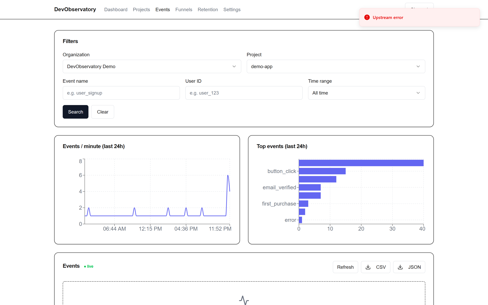
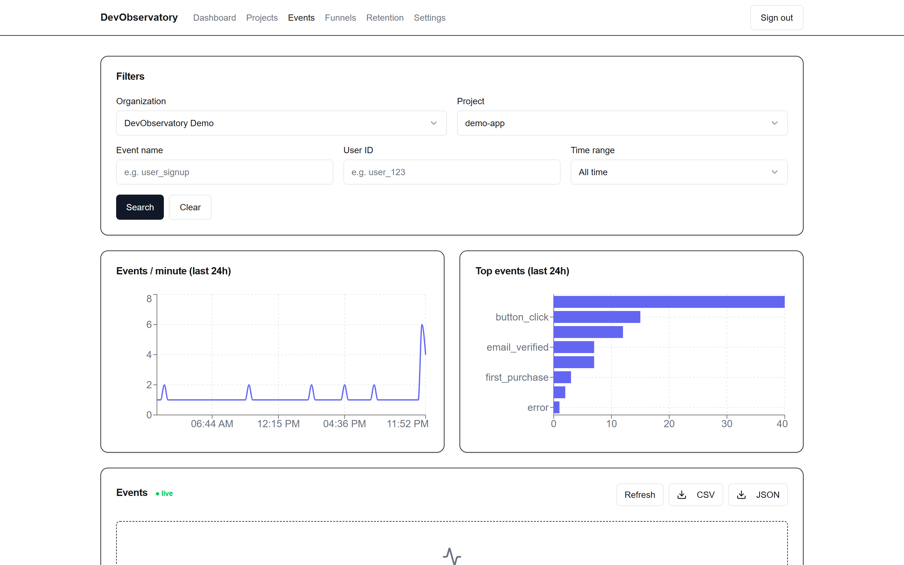
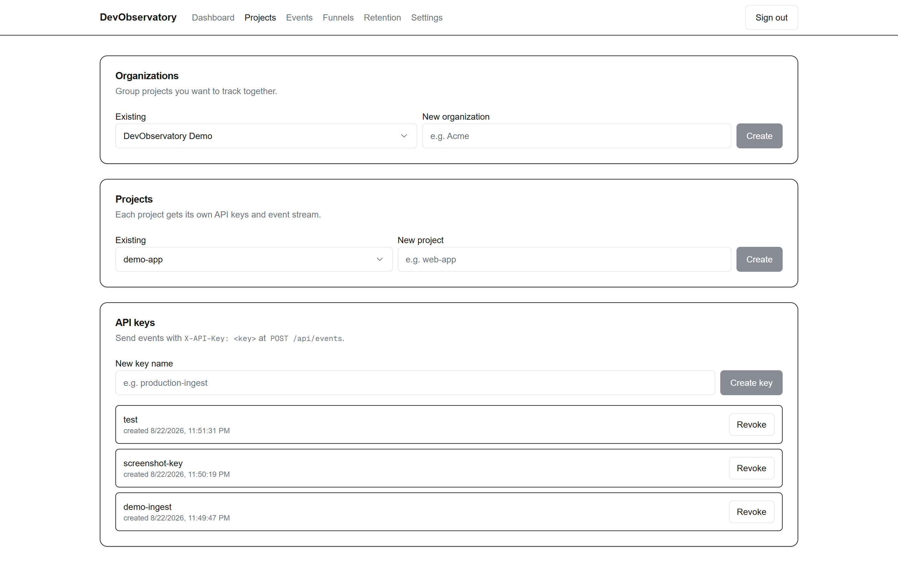
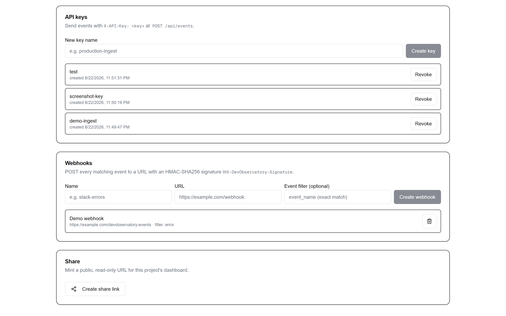
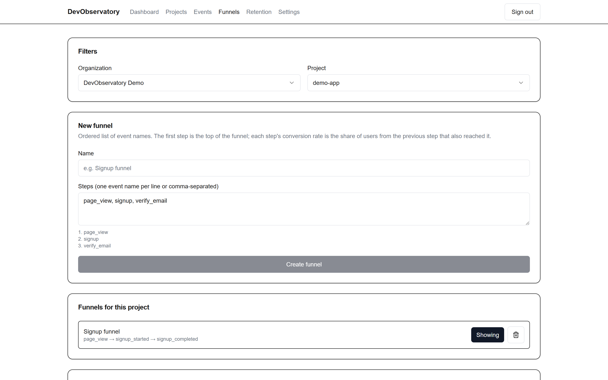
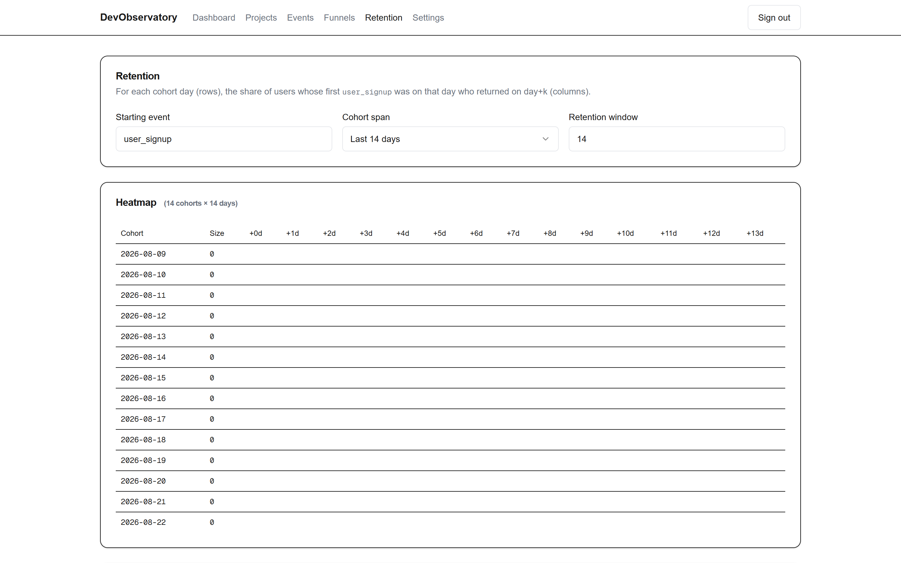

# DevObservatory

DevObservatory is a lightweight “developer observability” side project: create projects, mint API keys, ingest events, and explore them in a small UI.

## Screenshots

### Marketing landing


### App









## Features

- Organizations and Projects
- API keys per project (per-key last-used tracking)
- Event ingestion (`X-API-Key`, async via RabbitMQ → worker → Postgres)
- Live event stream (Server-Sent Events, Postgres NOTIFY trigger)
- Event search and filter (event_name, user_id, time range) with cursor pagination
- CSV / NDJSON export of events with Excel-formula injection guards
- Per-project analytics dashboard: time-series chart, top-events bar chart
- Conversion funnels (ordered event names → step-by-step conversion)
- Funnel snapshots + 14-day trend (per-step conversion rate over time)
- Cohort retention heatmap (pick a starting event, see how many users returned on day+0..N)
- Outbound webhooks with HMAC-SHA256 signing (per-webhook secret, event-name filter, SSRF guard)
- Stack-trace pretty-printing (`release` + `environment` on ingest, Sentry/Python/JS frame parsing)
- One-click demo data seed (~3,000 events across 30 days)
- Tokenized public share links (read-only dashboards, 30-day TTL)
- SDK snippet generator (cURL / Node / Python / Go)
- Refresh-token rotation with family-based reuse detection
- Invite flow with expiry + revocation
- Rate limiting (SlowAPI) on auth endpoints
- Security headers (HSTS, nosniff, X-Frame-Options, Referrer-Policy, Permissions-Policy)
- Marketing landing page (hero, feature grid, "how it works")
- Mobile-responsive nav

## Tech Stack

- Backend: FastAPI + SQLAlchemy + Alembic + Postgres
- Frontend: Next.js 16 (App Router) + React 19 + Tailwind v4
- Data: TanStack Query v5, Zustand (selector store), Sonner (toasts), Recharts
- UI: shadcn/ui-style Radix primitives (Dialog, Dropdown, Select, Tooltip)
- Queue/Worker: RabbitMQ + aio-pika worker
- Infra: Docker Compose (Postgres, Redis, RabbitMQ, MinIO)
- Tests: pytest (65 tests covering security, funnels, retention, search, webhooks, stack traces, snippets, exports, secrets)

## Architecture

High-level flow:

1. Client sends event to `POST /api/events` using `X-API-Key`.
2. Backend validates key and publishes to RabbitMQ queue `events`.
3. Worker consumes and persists to Postgres.
4. Frontend queries backend via Next.js BFF routes (`/api/*`) and httpOnly cookies.

More details: [docs/ARCHITECTURE.md](docs/ARCHITECTURE.md)

## Repo Layout

- backend/: FastAPI API server + Alembic migrations
- worker/: RabbitMQ consumer that writes events to Postgres
- frontend/: Next.js UI + BFF routes under `src/app/api`
- docker/: Dockerfiles
- scripts/: run helpers (Docker + local dev)
- docs/: diagrams + screenshots
- docker-compose.yml: local runtime

## Ports

| Service | URL |
|---|---|
| Frontend | http://localhost:3000 |
| Backend | http://localhost:8000 |
| Backend health | http://localhost:8000/healthz |
| RabbitMQ management | http://localhost:15672 |
| Postgres | localhost:5432 |
| Redis | localhost:6379 |
| MinIO S3 API | http://localhost:9000 |
| MinIO console | http://localhost:9001 |

## How to Run

### Option A: All-in-Docker (fastest)

Prereqs: Docker Desktop (or Docker Engine + Compose).

```bash
bash scripts/docker-up.sh
```

Open:

- UI: http://localhost:3000
- API health: http://localhost:8000/healthz

Stop:

```bash
bash scripts/docker-down.sh
```

Reset volumes (drops Postgres + MinIO data):

```bash
bash scripts/docker-reset.sh
```

### Option B: Docker infra + local dev servers (best for development)

Prereqs:

- Docker
- Node.js (frontend)
- Python 3.12 (backend)

Start infra services only:

```bash
bash scripts/docker-infra-up.sh
```

Run backend (creates `backend/.venv` and installs deps automatically):

```bash
bash scripts/dev-backend.sh
```

Run frontend:

```bash
bash scripts/dev-frontend.sh
```

## Smoke Test

Minimal end-to-end path (register → login → create org/project → create api key → ingest event → query events):

```bash
bash scripts/smoke.sh
```

## API Overview

Base URL: `http://localhost:8000/api`

Auth:

- `POST /auth/register`
- `POST /auth/login`
- `POST /auth/refresh`
- `POST /auth/logout`
- `GET /auth/me`

Orgs / projects:

- `POST /orgs`
- `POST /orgs/{org_id}/projects`
- `POST /projects/{project_id}/api-keys`

Events:

- `POST /events` (requires `X-API-Key`)
- `GET /projects/{project_id}/events` (requires Bearer access token)
- `GET /projects/{project_id}/events/search` (cursor-paginated, supports `event_name`, `user_id`, `from`, `to` filters)
- `GET /projects/{project_id}/events/stream` (Server-Sent Events)
- `GET /projects/{project_id}/events/export?format=csv|json` (filtered export, max 10,000 rows)

Funnels:

- `GET/POST /projects/{project_id}/funnels`
- `DELETE /projects/{project_id}/funnels/{funnel_id}`
- `GET /projects/{project_id}/funnels/{funnel_id}/result` (current conversion)
- `POST /projects/{project_id}/funnels/{funnel_id}/snapshot` (snapshot today's funnel)
- `GET /projects/{project_id}/funnels/{funnel_id}/trend?days=14`

Retention:

- `GET /projects/{project_id}/retention?event_name=...&days=14&max_window=14`

Webhooks (outbound):

- `GET/POST /projects/{project_id}/webhooks`
- `DELETE /projects/{project_id}/webhooks/{webhook_id}`

Frontend BFF:

- Next.js server routes live in [frontend/src/app/api](frontend/src/app/api).
- They forward requests to the backend using `API_BASE_URL` / `NEXT_PUBLIC_API_BASE_URL` and manage auth cookies.

## Configuration

Backend (see [backend/app/core/config.py](backend/app/core/config.py)):

- Copy example env and edit locally:
  - `cp backend/.env.example backend/.env`
  - `cp frontend/.env.local.example frontend/.env.local`

- `POSTGRES_DSN`
- `REDIS_URL`
- `RABBITMQ_URL`
- `JWT_SECRET_KEY`
- `CORS_ALLOWED_ORIGINS` (JSON string or comma-separated)
- `S3_ENDPOINT_URL`, `S3_ACCESS_KEY_ID`, `S3_SECRET_ACCESS_KEY`, `S3_BUCKET`

Frontend:

- `NEXT_PUBLIC_API_BASE_URL`
- `API_BASE_URL`

## Troubleshooting

- Signup returns 500: check backend logs; password hashing relies on `passlib` + `bcrypt`.
- Hydration mismatch warnings: browser extensions can inject attributes into the DOM before React hydrates.
- Queue unavailable: RabbitMQ might not be ready yet; restart the worker or wait a few seconds.
